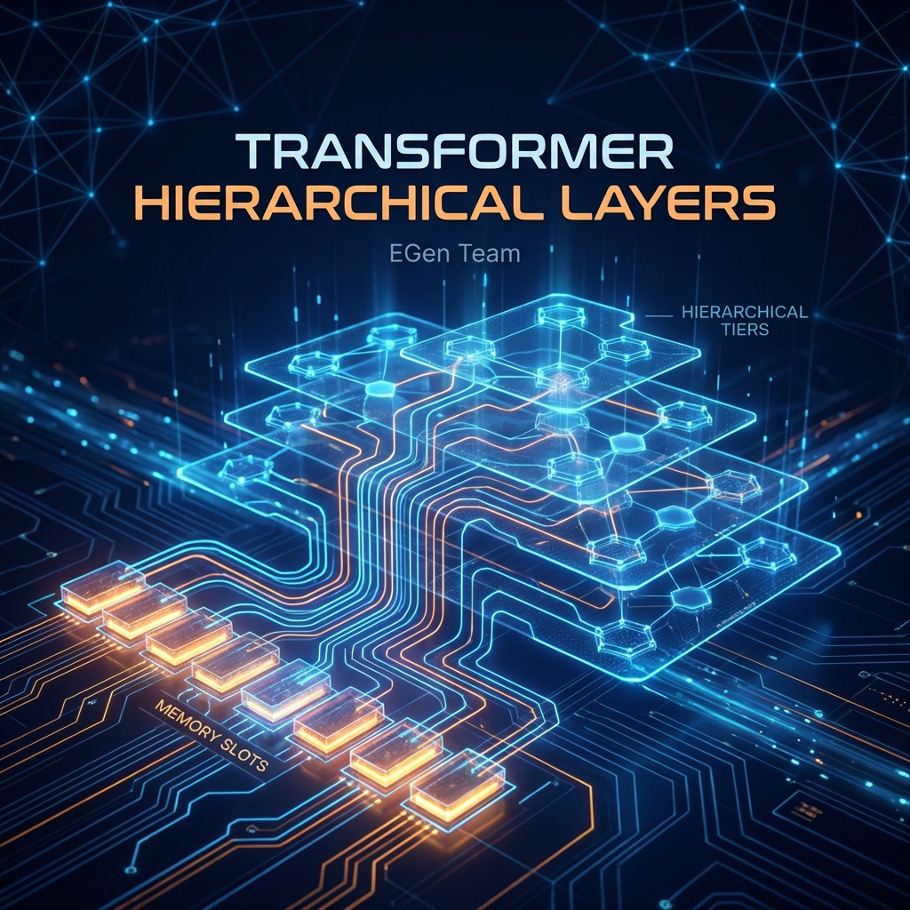

<!---
Copyright 2026 EGen Team. All rights reserved.

Licensed under the MIT License.
-->

<div align="center">
    
</div>
<br>

<p align="center">
    
    
    
    <a href="https://github.com/EGen-V/Transformer-Hierarchical-Layers/actions"></a>
</p>

<h1 align="center">🤗 THL: Transformer Hierarchical Layers</h1>

<p align="center">
    <a href="README_AR.md">العربية</a> |
    <a href="../../README.md">English</a> |
    <a href="README_ES.md">Español</a> |
    <a href="README_FR.md">Français</a> |
    <a href="README_zh-hans.md">简体中文</a>
</p>

<h3 align="center">
    Modelos Recurrentes Jerárquicos de Vanguardia para Hardware de Bajos Recursos
</h3>

<p align="center">
    THL es un grafo de computación recurrente jerárquico, estrictamente no Transformer, diseñado para ejecutar grandes modelos de lenguaje en <b>4GB de VRAM</b> y dispositivos móviles.
</p>

---

**THL** resuelve el problema específico de la **explosión de memoria caché KV** en Transformers utilizando **Memoria Independiente de la Longitud de Secuencia** (memoria O(1) por capa). Logra un rendimiento competitivo con Transformer mientras permite la inferencia en hardware de consumo.

## ⚡ ¿Por qué usar THL?

1.  **Memoria Acotada (O(1))**: Olvídese de la caché KV O(T). THL utiliza memoria de ranuras fijas (`J=1024`), permitiendo la generación de contexto infinito sin bloquear su GPU.
2.  **Recurrencia Jerárquica**: Los niveles GRU de múltiples escalas de tiempo procesan información a diferentes frecuencias ($\tau_k$), capturando tanto la sintaxis local como la semántica global de manera eficiente.
3.  **Inferencia de Baja VRAM**: El **Motor de Inferencia por Capas** integrado permite ejecutar modelos de más de 7B parámetros en <4GB de VRAM.
4.  **Enrutamiento Disperso**: El enrutamiento Top-K de múltiples cabezales asegura que se acceda a las memorias relevantes sin procesar todo el historial.

## 🛠️ Instalación

```bash
# Clonar el repositorio
git clone https://github.com/EGen-V/Transformer-Hierarchical-Layers.git
cd Core

# Instalar dependencias
pip install -r requirements.txt
pip install .
```

## 🚀 Recorrido Rápido

### 1. Modelado de Lenguaje Básico

Instancie fácilmente un modelo y ejecute un paso hacia adelante:

```python
import torch
from thl.config import THLConfig
from thl.model import THLModel

# Configurar para 4GB VRAM
config = THLConfig(
    num_tiers=3,
    memory_slots=1024,
    dim=768
)

model = THLModel(config)
input_ids = torch.randint(0, 50257, (1, 32))
logits, state = model(input_ids)
```

### 2. Generación con Baja VRAM (Streaming)

Ejecute modelos más grandes transmitiendo capas a la GPU una por una:

```python
from thl.inference.layered import LayeredInferenceEngine
from thl.inference.state import InferenceState

engine = LayeredInferenceEngine(model, device="cuda")
state = InferenceState.init(1, config, model.tiers, model.memory_bank)

# Paso de generación de un solo token
token = torch.tensor([123])
logit, state = engine.step(token, state)
```

## 🏗️ Arquitectura

| Componente | Símbolo | Descripción |
|-----------|---|-------------|
| **Banco de Memoria** | $M_t$ | Matriz de tamaño fijo ($J \times d$) que mantiene el contexto a largo plazo. |
| **Enrutador Disperso** | $r_t$ | Mecanismo de enrutamiento Top-K para leer ranuras relevantes. |
| **Niveles Jerárquicos** | $s_t^{(k)}$ | Pila de celdas recurrentes que se actualizan a intervalos exponenciales $\tau=2^k$. |
| **Escritor de Novedad** | $w_t$ | Mecanismo con compuerta para escribir solo información nueva en la memoria. |

## 🧪 Rendimiento Verificado

Probamos THL rigurosamente. Ejecute la suite usted mismo:
```bash
./scripts/run_tests.sh
```

## 📜 Licencia

Este proyecto está bajo la Licencia MIT.
